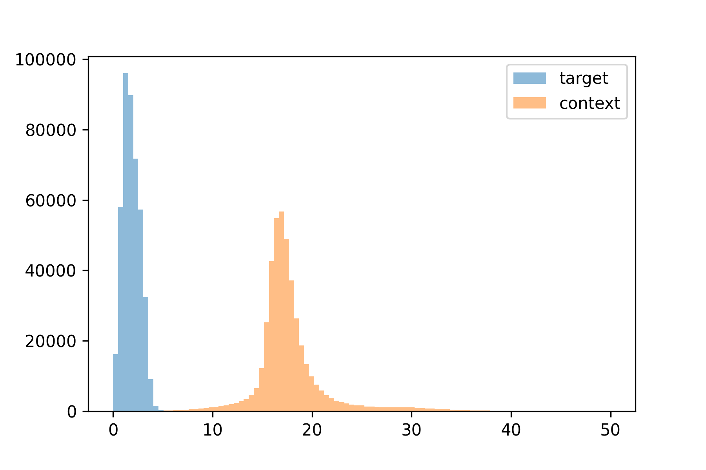

## Portfolio

---

### Multimodal Neural Machine Translation

 \
I built a multimodal transformer to translate from English to Chinese while incorporating additional context from images. Visual context is typically most useful in translation when there is missing information in the source text. I generated synthetic noise by randomly masking content words in the source text and compared my multimodal model with a text only baseline. The multimodal model achieved around 2 point improvement in BLEU score over the baseline. Take a look at my [writeup](pdf/CS401R_Final_Project.pdf) or [presentation](pdf/mmt_presentation.pdf) to learn more about what I did.

  

---

### Text Summarization

 

Static word embeddings like word2vec have been used for many extractive text summarization approaches. Algorithms like word2vec typically learn 2 sets of embeddings termed "target" and "context" vectors. It is common practice to discard the "context" vectors and use the "target" vectors for downstream tasks. I identified key structural differences between "target" and "context" spaces and explored whether these differences would impact performance on several extractive text summarization tasks. Learn more [here!](pdf/TextSummarization.pdf) 

  

---

### Particle Filtering

For a final class project my team got access to time series spectrographic data from a local health care start up. Our goal was to reduce noise in the readings to extract a smoothed underlying signal, and replace corrupted sections of the time series data so that it can be used in other predictive algorithms. To do this we applied two state space filtering methods: the Kalman filter and the particle filter. Take a look at our write up [here!](/pdf/Vol_3_Filtering_Project.pdf) My main contribution was the particle filter to which I have attatched a github link to the implementation I made. 

  

---
